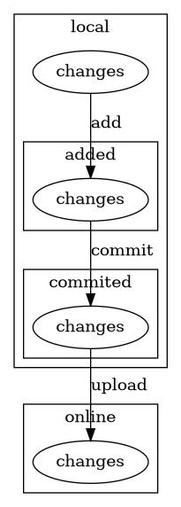

# Table of Contents

1.  [A guide of simulation](#org489f2a7)
2.  [wish list <code>[1/2]</code>](#org2bbed22)
3.  [Recommend](#org7c581d4)
    1.  [immersive translate](#org568f110)
    2.  [google](#org14fdd2a)
4.  [Git](#org211bf61)
    1.  [Configuration](#org3f7271a)
    2.  [Main](#orgaf22d67)
        1.  [clone](#org90115fd)
        2.  [manage repo](#org847c4ec)
5.  [Google](#org63ea82e)
6.  [Neovim](#orge767fc0)
    1.  [简介](#org4af805a)
    2.  [下载](#orgcaa4ada)
        1.  [Ubuntu](#orgdf9bbcd)
        2.  [windows](#org15e29de)
    3.  [使用方法](#org34f54df)
        1.  [打开 neovim](#org852c73c)
        2.  [如何使用 Neovim](#org2d5c3d8)

# A guide of simulation

# wish list <code>[1/2]</code>

-   [ ] git

# Recommend

## immersive translate

## google

# Git

## Configuration

    git config global --global user.name "<username>"
    git config global --global user.email "<email>"

## Main

program + parameters

### clone

    git clone <repo_path>
    git clone https://github.com/2025-simulation/simple-chat-app.git
    git clone git@github.com:2025-simulation/simple-chat-app.git

### manage repo

    git init # initialize the git repo
    git add <the file or folders>
    git commit -m "Message"

The progress

1.  wished list

    

2.  建立远程仓库

    对于如何在 GitHub 建立一个远程仓库，可以参考 [这个文档](https://docs.github.com/zh/get-started/git-basics/managing-remote-repositories) 。

# Google

现在我们面临的一些问题都是专业性质比较强的问题，目前中文互联网的可提供的解决方案比较少，于是我们可能绝大部分时间需要在英文互联网寻找解答。

目前英文互联网最好的搜索引擎就是 [google](https://google.com) 。
在一些专业的论坛上通常能够找到最好的答案，比如 [stackoverflow](https://stackoverflow.com/questions) 和 [reddit](https://www.reddit.com/)

# Neovim

## 简介

Neovim 是一个终端下的专业的文本编辑器，可以方便地在终端下面直接编辑文本，而不需要退出终端、打开其他软件然后在翻看文件路径找到需要编辑的文件。

## 下载

这个是官方的下载地址 [Neovim](https://neovim.io) ，一切以官方的下载地址为准。

### Ubuntu

    sudo apt install neovim

### windows

在官网下载安装安装文件后打开（windows 系统会自动拦截所有类似于可安装程序的文件，不用理会，保留即可），安装之后。在 Windows 的终端下面输入 `nvim` 既可以运行。
tips: 如果不清楚下载的页面的含义，建议自己上网查询，否则不要改动，全部按照默认安装即可。

## 使用方法

### 打开 neovim

在终端里面输入 `nvim test.md` ，实际就是使用 neovim 创建（如果没有）并且打开一个名为 test 的 markdown 文件。
本质上终端下使用程序就是输入程序名然后跟上一系列的参数。对于文本编辑器实际上使用频率最高的方式就是编辑文件的文件名。
而所有文件的编辑名称分为两个部分：文件名和文件类型。

-   `test.word`: 这就是一个名为 test 的 word 文档。
-   `test.md`: 这是一个 markdown 语法的文档。和 txt 一样属于文本文件，在编程领域尤为常见。

### 如何使用 Neovim

Neovim 里面有官方自带的教程。
输入 `nvim` 打开 Neovim 之后，不要乱动键盘，确认是英文输入法之后输入 `:Tutor` 然后回车即可查看。注意在输入冒号之后会在左下角出现输入提示，可以查看拼写。
如果阅读英文文档有一些压力，可以选择参考下面的网站 [Neovim Tutor](https://yianwillis.github.io/vimcdoc/doc/usr_toc.html) 。

